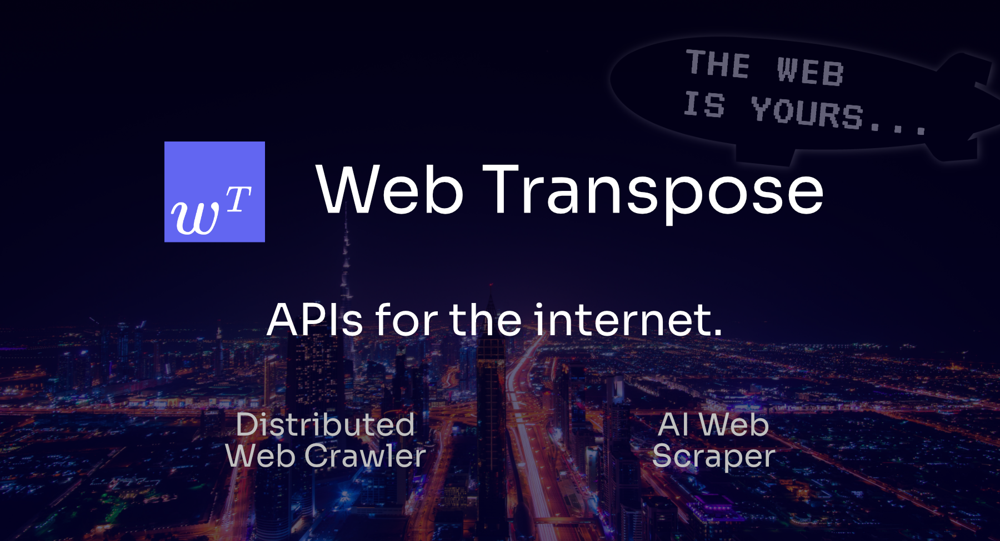

<a href="https://webtranspose.com">
  
  <h1 align="center">Web Transpose</h1>
  <p align="center"><b>
    Web Crawler & AI Web Scraper APIs for building new web experiences.
  </b></p>
</a>

```bash
pip install webtranspose
```

<h4 align="center">
  <a href="https://twitter.com/mikegeecmu">
    
  </a>
  <a href="https://github.com/mike-gee/webtranspose/blob/master/LICENSE.rst">
    
  </a>
  <a href="https://github.com/mikegeecmu/webtranspose/blob/main/LICENSE">
    
  </a>
</h4>


<p align="center">
  <a href="#introduction"><strong>Introduction</strong></a> ·
  <a href="#installation"><strong>Installation</strong></a> ·
  <a href="https://docs.webtranspose.com"><strong>Docs</strong></a>
</p>
<br/>

## Introduction

In the near future, **nobody will open websites**. Instead, we will be directly served the information we are seeking. New web experiences will combine the information from many websites into a single, unified experience.

**Web Transpose** is a collection of API tools that allow building these new web experiences simple.

- [Webᵀ Crawl: Distributed Web Crawler](#crawl)
- [Webᵀ Scrape: AI Web Scraper](#scrape)


### Crawl

```python
import webtranspose as webt

import os
os.environ['WEBTRANSPOSE_API_KEY'] = "YOUR WEBT API KEY"

crawl = webt.Crawl(
    "https://www.example.com",
    max_pages=100,
    render_js=True,
)
await crawl.crawl() # crawl.queue_crawl() for async
```

## Scrape

```python
import webtranspose as webt

import os
os.environ['WEBTRANSPOSE_API_KEY'] = "YOUR WEBT API KEY"

schema = {
    "Merchant Name": "string",
    "Title of Product": "string",
    "Product Photo URL": "string",
}

scraper = webt.Scraper(
    schema, 
    render_js=True, 
)
out_json = scraper.scrape("https://www.example.com")
```

## Web Search (SERP API)

```python
import webtranspose as webt

import os
os.environ['WEBTRANSPOSE_API_KEY'] = "YOUR WEBT API KEY"

results = webt.search("what caused the fourth great ninja war?")
# results.keys()
# ['results']

# AI Filter
results = webt.search_filter("Paul Graham's Blog")
# results.keys()
# ['results', 'filtered_results']
```


## Installation

Non-Python Users: [📄 API Docs](https://docs.webtranspose.com).

This repo contains a local **lite** installation of Web Transpose. This is a good option if you want to run Web Transpose locally on your machine for quick use cases. 

```shell
pip install webtranspose
```

However, if you wish to leverage the full tools of Web Transpose and use in production, you should add your API key to add the **full** version.

```python
os.environ["WEBTRANSPOSE_API_KEY"] = "YOUR_API_KEY_HERE"
```


## Enterprise Support

Web Transpose serves enterprises small and large. We partner with companies for the long term with hands-on support and custom solutions.

Please email me directly at mike@webtranspose.com for enquiries.
